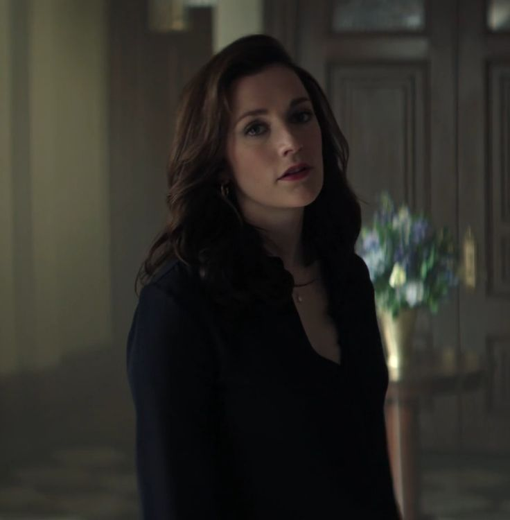

# practica-final-html (YOU Netflix)

-El sitio web incluye información detallada sobre las 5 temporadas, algunos de los personajes principales, un enlace a la serie oficial y los posters de cada temporada.

## Imagenes usadas

## Características Principales
Diseño responsive mobile-first  
Barra de navegación fija con efectos hover  
Sección hero con imagen de fondo degradada  
Carrusel horizontal de personajes  
Grid de temporadas adaptable  
Animaciones CSS personalizadas  
Menú hamburguesa para móviles  

-Escogí eso para mi página porque quería mantener una estética simple pero que fuera acorde a la serie. Entrando con una pequeña introducción de cada temporada, pasando por los personajes principales más conocidos y luego por último los posters promocionales de cada temporada colocados en orden. El botón del principio es funcional y te lleva directamente a la página de Netflix donde se encuentra la serie.

## Estructura del Layout

1. Header (Fijo con navegación)
2. Hero Section (Imagen de fondo con contenido)
3. Main Content:
   - Sección de Resumen
   - Carrusel de Personajes
   - Grid de Temporadas
4. Footer (Información legal)

